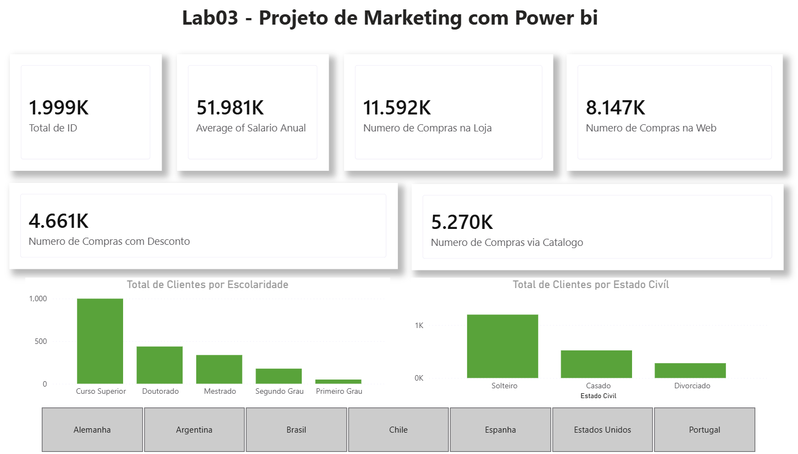
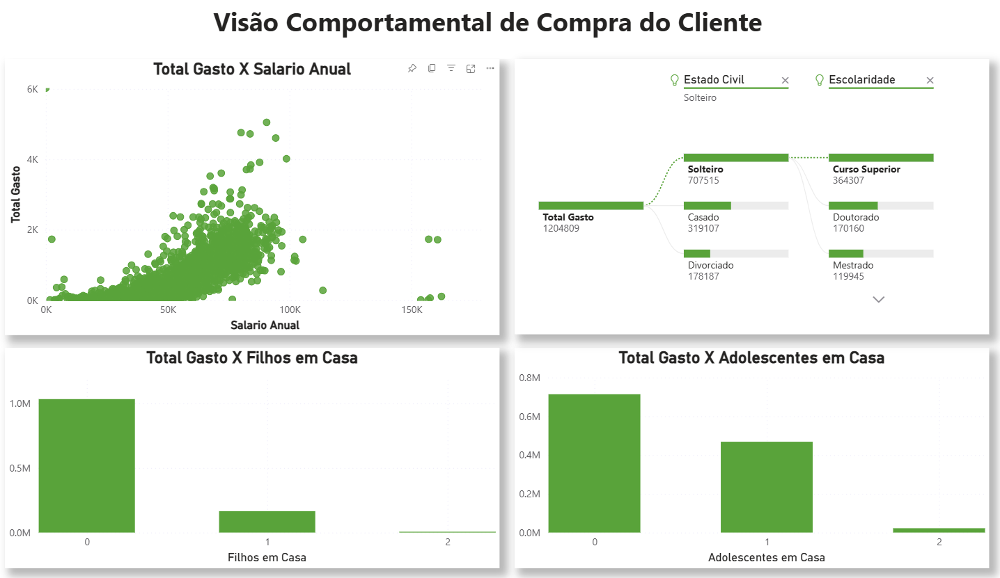
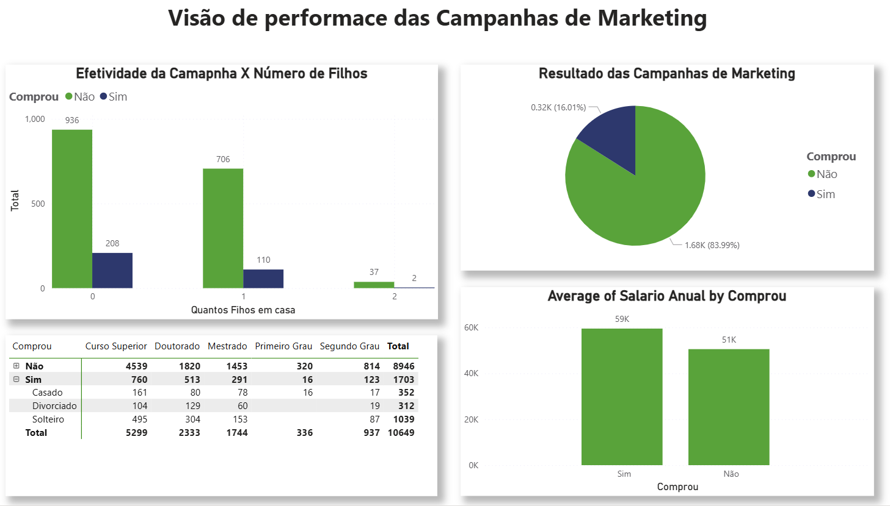
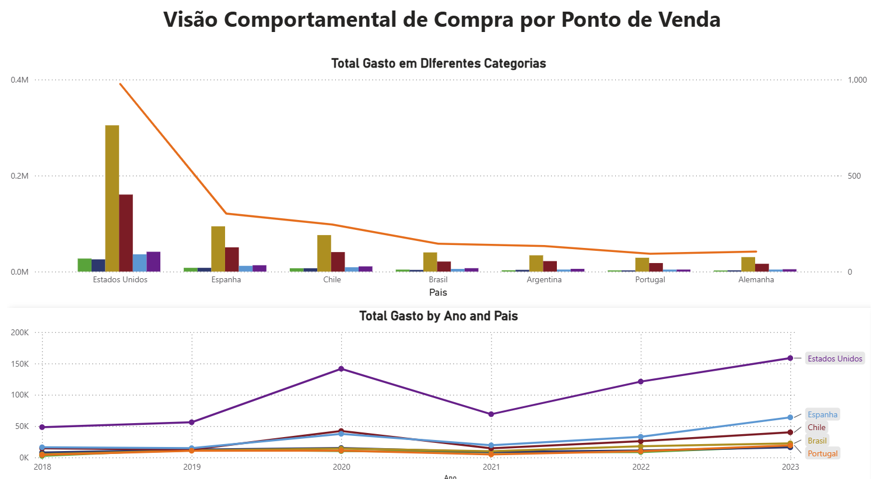

# Dashboard de Marketing com Power BI

Projeto desenvolvido durante o curso da Data Science Academy, com foco em análise de dados de marketing, comportamento do cliente e performance de campanhas utilizando Power BI.

---

## Dashboard

### Visão Geral

---

### Visão Comportamental de Compra do Cliente

---

### Visão de Performance das Campanhas de Marketing

---

### Visão Comportamental de Compra por Ponto de Venda

